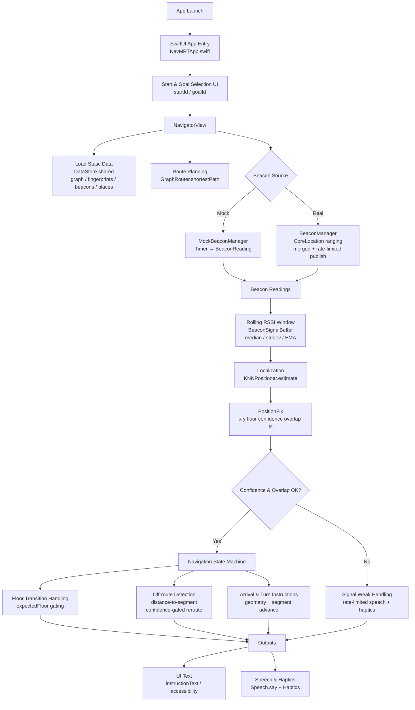

# NavMRT

NavMRT is a **blind-first indoor navigation iOS application** designed to assist visually impaired passengers in MRT stations.  
It uses **Bluetooth iBeacons**, **RSSI fingerprinting**, and **voice-first UX** to provide turn-by-turn indoor guidance.

This project focuses on **accessibility, robustness, and real-world deployability**, rather than visual maps.

## 🎯 Project Goals

- Enable **independent indoor navigation** for visually impaired users
- Provide **voice-first, VoiceOver-optimized UX**
- Support **multi-floor navigation** (elevators / stairs)
- Detect **off-route behavior** and recover automatically
- Be deployable with **real beacon hardware**

## ✨ Key Features

### Navigation & Positioning
- RSSI fingerprinting with **KNN positioning**
- Exponential Moving Average (EMA) RSSI smoothing
- Graph-based routing (shortest path)
- Turn-by-turn instructions (left / right / straight / U-turn)
- Arrival detection with haptics + voice feedback

### Accessibility (Blind-first UX)
- VoiceOver-first screen focus
- Auto-start navigation option
- Spoken route summaries
- Clear, non-spammy audio prompts
- Large, simple control layout

### Robustness
- Off-route detection using geometric distance to path
- Automatic re-routing from nearest node
- Floor change handling with elevator / stairs announcements
- Navigation pause during floor transitions

### Beacon Support
- Mock beacon manager for simulator & development
- Real iBeacon integration via CoreLocation
- RSSI Console for live signal debugging
- Strict ID consistency (`UUID:major:minor`) across pipeline

## 🚦 Current Status

- ✅ End-to-end navigation pipeline implemented
- ✅ Mock beacon testing complete
- ✅ Real beacon integration ready
- 🔬 Actively extending and refining (research prototype)

## 🔮 Future Work

- Floor-specific beacon filtering
- In-app fingerprint collection mode
- Background navigation support
- User studies & on-site MRT deployment
- Energy optimization & signal stabilization

